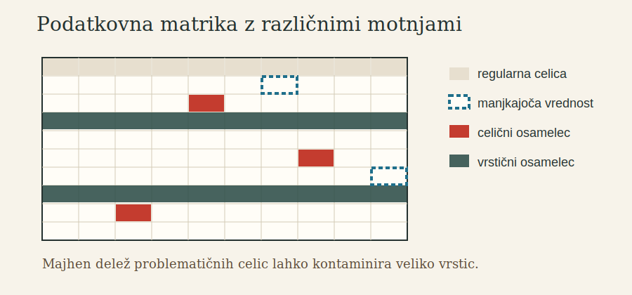

# 1. PCA na neurejenih realnih matrikah

Klasična PCA začne z urejeno matriko podatkov: vrstice so objekti, stolpci so spremenljivke, vsaka celica je opazovana vrednost. Nato išče nizkorazsežen linearni podprostor, ki pojasni čim več variabilnosti. Ta idealizacija je uporabna, vendar je za realne podatke pogosto prečista.

V praksi se v isti matriki pojavljajo vsaj tri motnje:

- manjkajoče vrednosti,
- celični osamelci,
- vrstični osamelci.

Manjkajoča vrednost pomeni, da celice ne opazimo. Celični osamelec pomeni, da je posamezna celica sumljiva, čeprav celotna vrstica ni nujno neobičajna. Vrstični osamelec pomeni, da je celoten objekt nezdružljiv z večino podatkov, na primer zato, ker pripada drugi populaciji ali ker je opazovanje sistematično poškodovano.

Klasična PCA teh razlik ne vidi. Vse vrednosti obravnava kot enako zaupanja vredne in zato lahko nekaj velikih odstopanj premakne center, spremeni kovariančno strukturo in zasuka glavne komponente. Posledica ni samo slabša numerična ocena. Posledica je lahko napačna interpretacija: komponenta, ki naj bi predstavljala glavni signal, v resnici opisuje napako merjenja ali mešanico populacij.

<Sidenote>
V tej knjigi uporabljamo izraz **osamelec** za podatkovni element, ki ni skladen z večinsko strukturo. Pri vrstičnih osamelcih je osamel objekt, pri celičnih osamelcih je osamela posamezna vrednost v sicer lahko regularni vrstici.
</Sidenote>

MacroPCA je zanimiva zato, ker ne obravnava samo enega izmed teh problemov. Metoda je zasnovana za primer, ko so v isti matriki hkrati prisotni manjkajoče vrednosti, celični osamelci in vrstični osamelci. To je bistveno težje kot navadna robustna PCA, ker robustnost na ravni vrstic ne zaščiti nujno pred napakami na ravni celic.

## Modelni pogled

Osnovna PCA predpostavlja, da lahko vrstico podatkov približno zapišemo kot center plus linearno kombinacijo nekaj komponent plus residual. Robustna različica mora isto strukturo oceniti tako, da je ne določijo ekstremne vrednosti.

Pri MacroPCA je naloga bolj subtilna. Algoritem ne želi preprosto »popraviti« matrike in nato pognati PCA. Ločiti mora:

- katere vrednosti manjkajo in jih je treba nadomestiti zaradi računanja,
- katere celice so sumljive in ne smejo dominirati ocenjevanja,
- katere vrstice so celostno osamele in jih ne smemo zakriti z agresivno imputacijo.

Ta razlika je pedagoško ključna. Imputacija je v tej metodi računski instrument, ne končna trditev o tem, kakšna je bila resnična vrednost.

## Zakaj to zahteva posebno metodo

Če imamo samo manjkajoče vrednosti, lahko uporabimo iterativno PCA z imputacijo. Če imamo samo vrstične osamelce, lahko uporabimo vrstično robustno PCA. Če imamo samo celične osamelce, lahko najprej uporabimo metodo za odkrivanje odstopajočih celic. Toda ko se vse tri motnje pojavijo skupaj, posamezni pristopi niso dovolj.

MacroPCA zato ni zgolj še ena varianta PCA. Je kompozicija diagnostičnih in robustnih korakov, ki morajo paziti, da popravljanje ene vrste problema ne prikrije druge.
