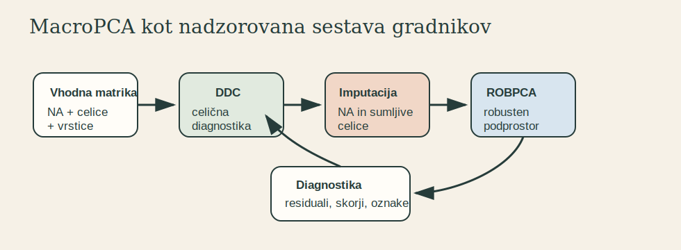

# 4. Gradniki: DDC, ICPCA in ROBPCA

MacroPCA je sestavljena metoda. Njena moč ni v eni sami novi ideji, temveč v skrbni kombinaciji treh obstoječih problemov in treh ustreznih gradnikov.

## DDC

DDC pomeni DetectDeviatingCells. Njegova naloga je zaznati celice, ki so sumljive glede na multivariatno strukturo podatkov, ne samo glede na svoj stolpec. Za MacroPCA je DDC pomemben kot začetni filter: pred robustnim ocenjevanjem podprostora zmanjša vpliv razpršenih celičnih osamelcev.

DDC ne reši celotne PCA naloge. Prispeva začetne oznake in imputacije za problematične celice ter s tem prepreči, da bi celična kontaminacija že v prvem koraku uničila oceno podprostora.

## ICPCA

ICPCA je iterativna PCA za manjkajoče vrednosti. Prispeva mehanizem, s katerim lahko algoritem dela z nepopolno matriko. Vendar sama po sebi ni robustna. Če so v podatkih osamelci, bo iterativna imputacija lahko sledila napačnemu podprostoru.

Njena vloga v MacroPCA je zato omejena in nadzorovana: uporabna je kot del iterativne sheme, ne kot samostojen odgovor na kontaminirane podatke.

## ROBPCA

ROBPCA je robustna PCA, zasnovana za vrstične osamelce. Uporablja robustne ideje za ocenjevanje podprostora, ki ga ne določijo ekstremne vrstice. Toda ROBPCA sama ne zadostuje, kadar je veliko vrstic delno kontaminiranih zaradi celičnih osamelcev.

Tu je glavni razlog za MacroPCA: preden vrstično robustna metoda presodi vrstice, je treba omiliti celično kontaminacijo.

## Skupna logika

MacroPCA uporabi DDC za celično raven, ICPCA za manjkajoče vrednosti in ROBPCA za vrstično robustnost. Pomembno je, da gradniki niso samo zaporedno nalepljeni. Algoritem mora ohraniti informacijo, katere celice so bile manjkajoče, katere so bile celično sumljive in katere vrstice so lahko celostno osamele.

| Gradnik | Primarni problem | Česa sam ne reši |
|---|---|---|
| DDC | celični osamelci | celotne PCA ocene in vrstične robustnosti |
| ICPCA | manjkajoče vrednosti | robustnosti na osamelce |
| ROBPCA | vrstični osamelci | propagacije celičnih osamelcev |

Ta tabela je tudi dober način za preverjanje razumevanja metode: MacroPCA ni robustna zato, ker bi en gradnik rešil vse, ampak zato, ker vsak gradnik omeji škodo na ravni, za katero je primeren.
