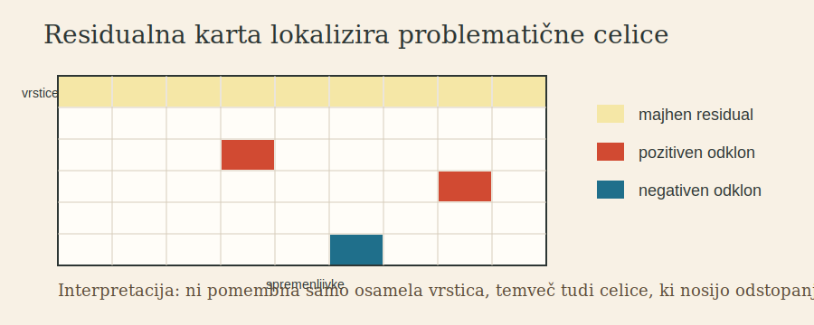
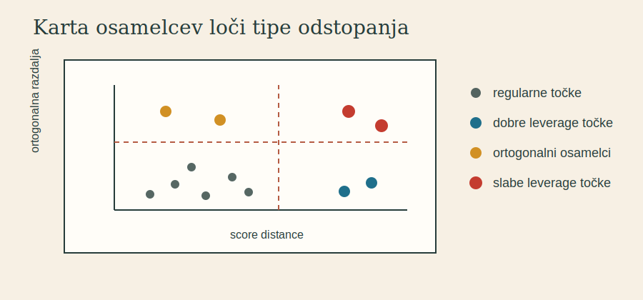

# 6. Diagnostika: residualna karta in karta osamelcev

MacroPCA je uporabna, ker ne odgovori samo na vprašanje, kateri podprostor je robusten. Odgovori tudi na vprašanje, kje so podatki problematični. Dva ključna prikaza sta residualna karta in karta osamelcev.

## Residualna karta

Residualna karta pokaže, katere celice imajo velike residuale glede na robustni PCA model. Namesto da bi povedala samo, da je vrstica nenavadna, lokalizira spremenljivke, ki prispevajo k odstopanju.

To je bistveno pri domenski interpretaciji. Če je osameli objekt pomemben, nas pogosto ne zanima samo, da je osamel, temveč tudi zakaj. Pri procesnem nadzoru to pomeni, katere meritve so odgovorne za alarm. Pri znanstvenih podatkih pomeni, katere spremenljivke nosijo nenavadno strukturo.

## Karta osamelcev

Karta osamelcev običajno primerja dve razdalji:

- razdaljo znotraj PCA podprostora, pogosto score distance,
- ortogonalno razdaljo od podprostora.

Ta ločitev omogoči štiri interpretacije:

- regularne točke imajo zmerni obe razdalji,
- dobre leverage točke so daleč znotraj podprostora, vendar ne daleč od njega,
- ortogonalni osamelci so slabo rekonstruirani s podprostorom,
- slabe leverage točke so problematične v obeh smislih.

<Question
  id="macropca-map-interpretation"
  question="Kaj residualna karta doda k navadni oznaki, da je vrstica osamela?"
  options={["Samo lepšo barvno različico iste informacije", "* Lokalizira spremenljivke oziroma celice, ki povzročajo odstopanje", "Dokazuje, da je osamela vrstica napaka merjenja", "Odpravi potrebo po robustni oceni podprostora"]}
  attempts={2}
>
Residualna karta je diagnostična zato, ker osamelost razgradi po celicah oziroma spremenljivkah. To je uporabno pri razlagi in ukrepanju.
</Question>

## Previdnost pri branju

Diagnostični prikazi niso avtomatska domenska razlaga. Velik residual pomeni neskladje z modelom, ne nujno napako. Dobra leverage točka je lahko legitimna ekstremna kombinacija vrednosti. Slaba leverage točka je statistično sumljiva, vendar mora domenski strokovnjak presoditi, ali gre za napako, nov režim ali redko veljavno stanje.

MacroPCA zato ne nadomešča domenske presoje. Zmanjša iskalni prostor: pokaže, katere vrstice in katere spremenljivke zahtevajo pozornost.
